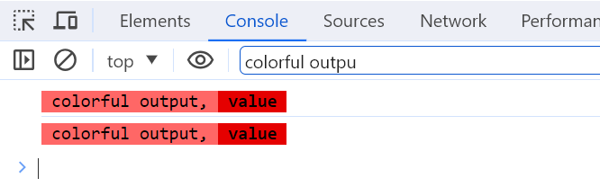

# UserScript Snippets

油猴脚本代码片段

- ## [sleep](./sleep.js)

```js
/**
 * 休眠给定的毫秒数
 *
 * @param mils
 * @returns {Promise<unknown>}
 */
async function sleep(mils) {
    return new Promise((resolve) => setTimeout(resolve, mils));
}

(async () => {
    // 注意需要在async块中使用 
    console.log("sleep begin")
    await sleep(3000);
    console.log("sleep end");
})();
```

- ## [now](./now.js)

```js
/**
 * 获取当前时间
 *
 * @return {string}
 */
function now() {
    const now = new Date();
    return "[" + stringAlignRight(now.getFullYear(), 4, "0") + "-" + stringAlignRight(now.getMonth() + 1, 2, "0") + "-" + stringAlignRight(now.getDate(), 2, "0") +
        " " + stringAlignRight(now.getHours(), 2, "0") + ":" + stringAlignRight(now.getMinutes(), 2, "0") + ":" + stringAlignRight(now.getSeconds(), 2, "0") + "." + stringAlignRight(now.getMilliseconds(), 3, "0") + "]";
}

/**
 * 把字符串右对齐到指定的长度，长度不足时使用给定的字符填充左边
 *
 * @param s { any } 要对齐的字符串
 * @param length { number} 要对齐到的长度
 * @param c { string } 长度不足时用什么字符补齐
 * @return { string }
 */
function stringAlignRight(s, length, c) {
    s = s + "";
    while (s.length < length) {
        s = c + s;
    }
    return s;
}

// 直接调用方法会返回格式化好的当前时间 
console.log(now());
// Output: [2023-12-27 22:45:15.082]
```

- ## [colorful console](./colorful-console.js)

```js
const valueStyle = `color: black; background: #E50000; font-size: 12px; font-weight: bold;`;
const normalStyle = `color: black; background: #FF6766; font-size: 12px;`;

const message = [

    normalStyle,
    " colorful output, ",

    valueStyle,
    ` value `,

    // ...(() => {
    //     if (!cookieValue) {
    //         return [];
    //     }
    //     return [
    //         normalStyle,
    //         ", value = ",
    //
    //         valueStyle,
    //         `${cookieValue}`,
    //     ];
    // })(),

];
console.log(genFormatArray(message), ...message);

function genFormatArray(messageAndStyleArray) {
    const formatArray = [];
    for (let i = 0, end = messageAndStyleArray.length / 2; i < end; i++) {
        formatArray.push("%c%s");
    }
    return formatArray.join("");
}
```

大概是这个效果：



